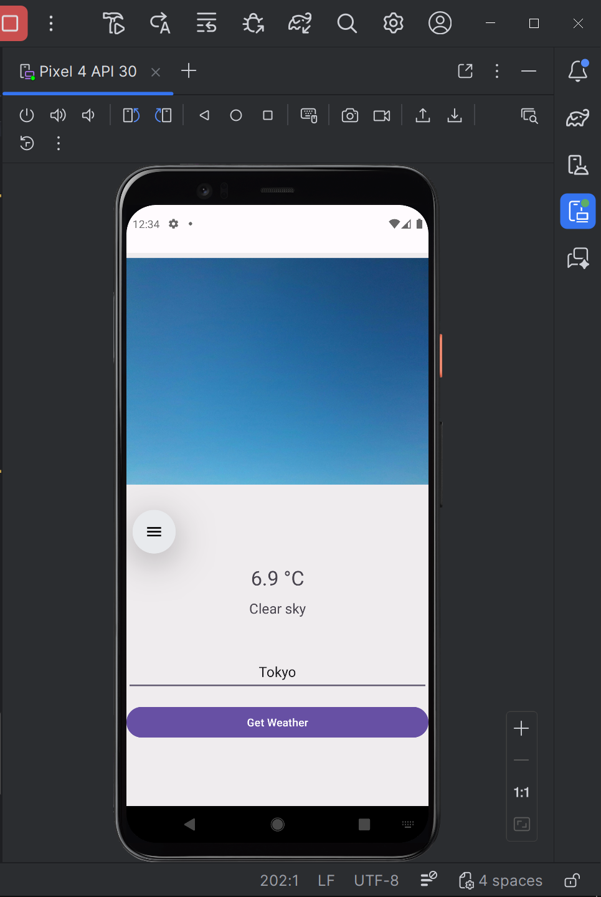
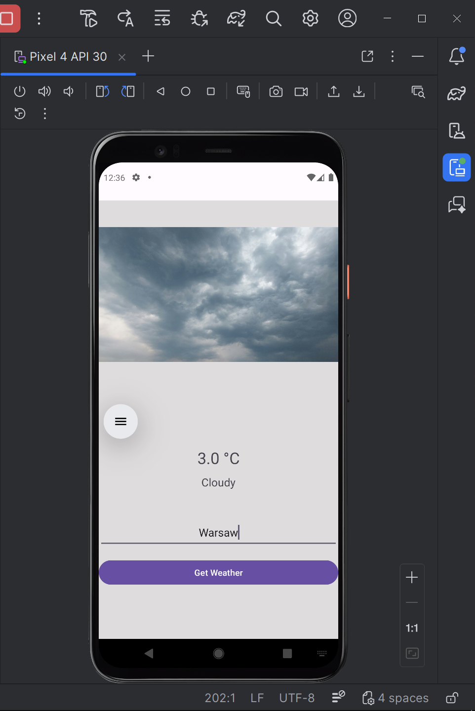
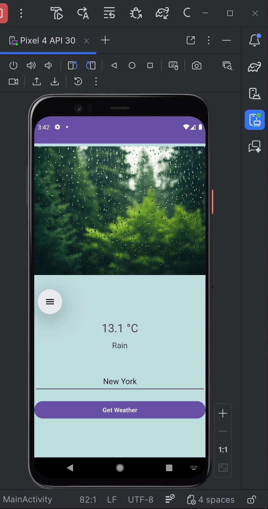
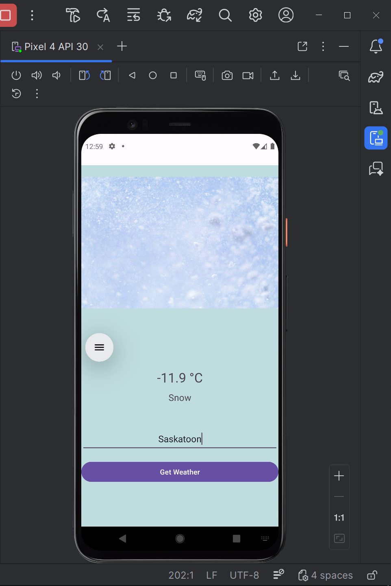
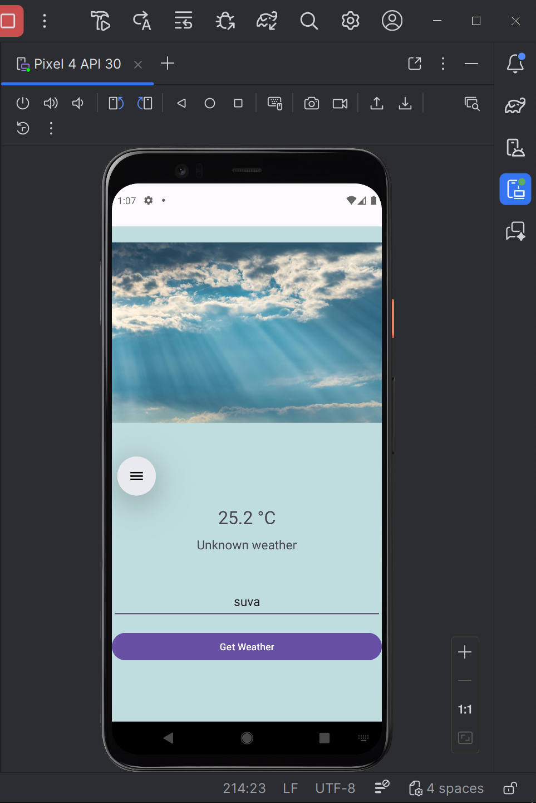
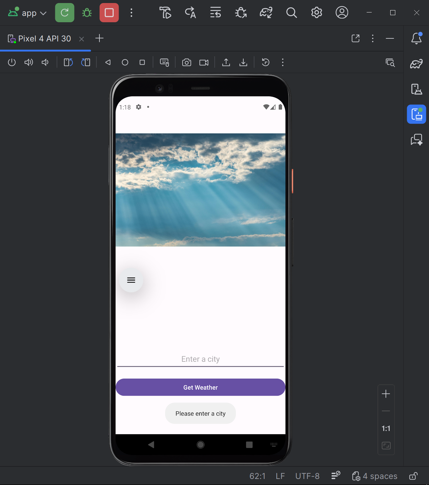
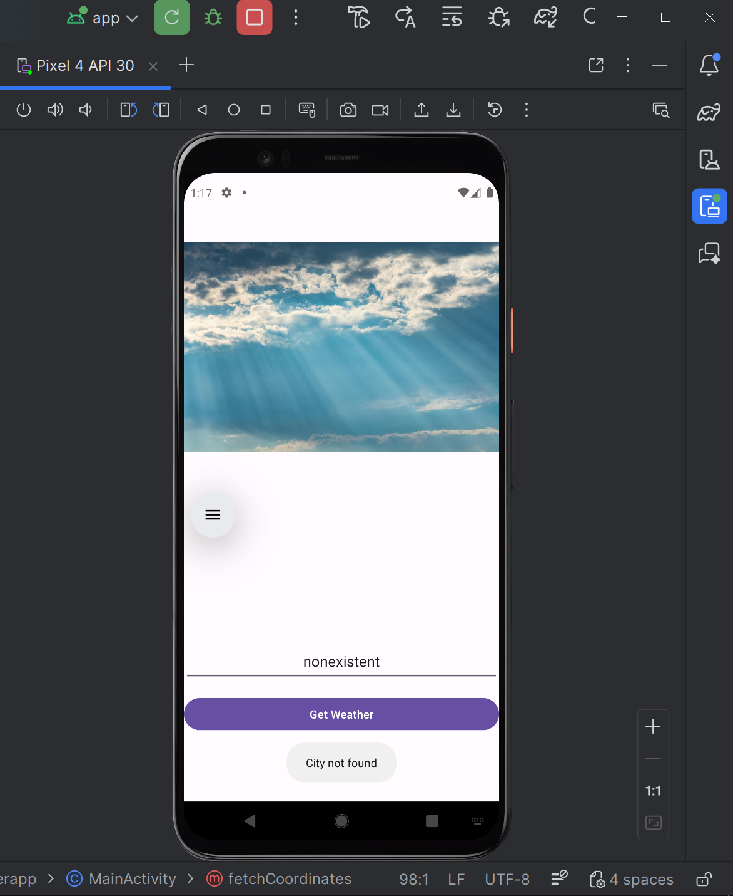
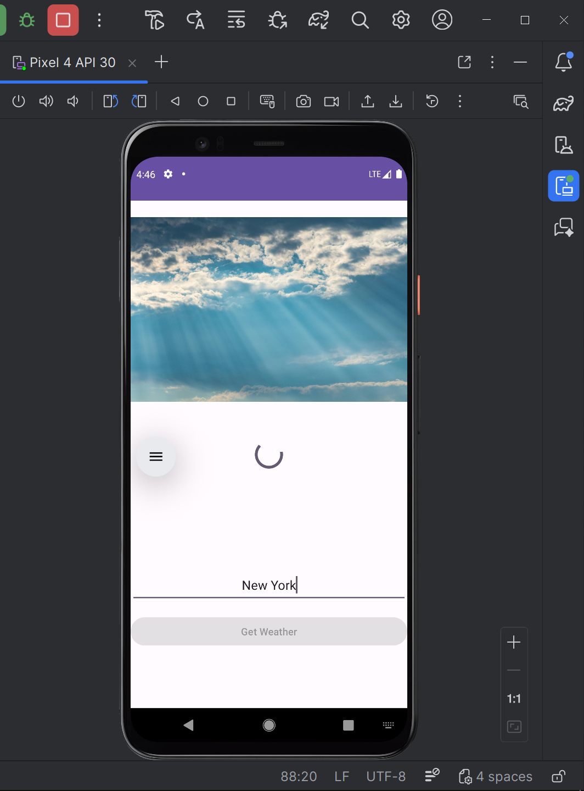
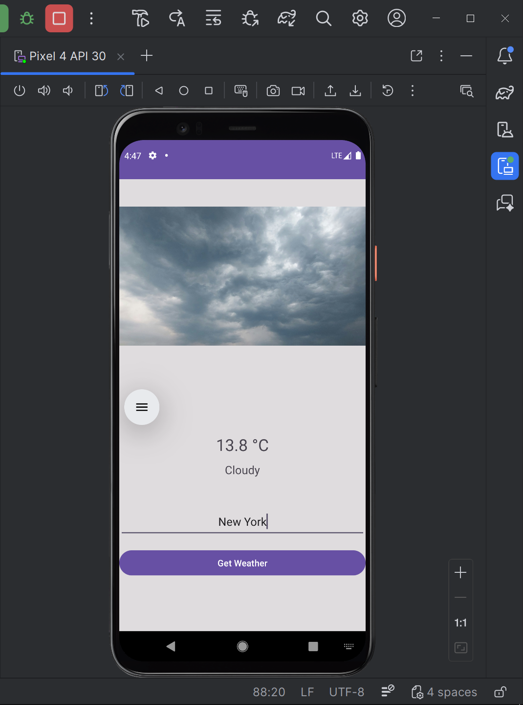

# WeatherApp

An Android application written in Java that allows users to check the current weather for any city. The app uses the Open-Meteo API to fetch real-time weather data based on city names.

## Table of Contents

- [Features](#features)
- [Tech Stack](#tech-stack)
- [How It Works](#how-it-works)
- [Permissions](#permissions)
- [Screenshots](#screenshots)

## Features

- Search weather by city name
- Display current temperature in Celsius
- Show weather description (clear sky, cloudy, rain, etc.)
- Background color and image changes depending on weather
- Loading indicator during network requests
- Error handling for invalid cities and network issues

## Tech Stack

- Language: Java
- Platform: Android
- Networking: `HttpURLConnection`
- Concurrency (Multi-threading): `ExecutorService` (background thread + UI thread updates)
- API: Open-Meteo (Geocoding + Forecast)

## How It Works

1. User enters a city name.
2. The app fetches latitude and longitude using the Open-Meteo Geocoding API.
3. Current weather data is retrieved using those coordinates.
4. Weather data is mapped to descriptions, images, and background colors.
5. UI updates dynamically with the results.

## Permissions

- `INTERNET` - required to fetch weather data from the API

## Screenshots

